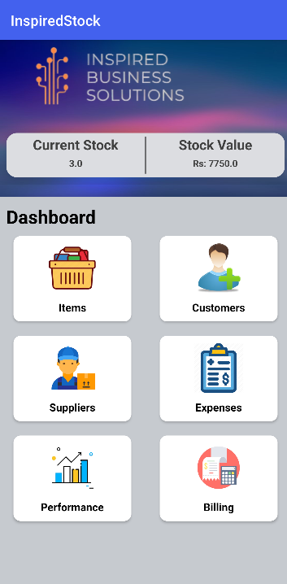

# StockApp: Mobile Stock Management App 📱📊

Welcome to StockApp, your go-to solution for mobile stock management! 🚀 This Android app, developed using Java and Android Studio, empowers users to effortlessly manage their stock, keeping everything organized and easily accessible on the go.

## 📸 Screenshots

## 🚀 Features

- **Intuitive UI:** User-friendly interface for smooth navigation.
- **Real-time Updates:** Stay informed with live stock updates.
- **Barcode Scanning:** Quickly add and manage products using barcode scanning.
- **Customizable Alerts:** Set alerts for low stock levels or other criteria.
- **Multi-User Support:** Collaborate with your team by adding multiple users.
- **Data Export:** Export your stock data for analysis or backup.

## 🛠 Installation

1. Clone the repository: `git clone https://github.com/your-username/your-repo.git`
2. Open the project in Android Studio.
3. Build and run the app on your Android device or emulator.

## 🤝 Contributing

Contributions are welcome! Follow these steps to contribute:

1. Fork the repository.
2. Create a branch: `git checkout -b feature/new-feature`.
3. Commit your changes: `git commit -m 'Add new feature'`.
4. Push to the branch: `git push origin feature/new-feature`.
5. Open a pull request.

## 📜 License

This project is licensed under the MIT License - see the [LICENSE](LICENSE) file for details.

## 📧 Contact

Have questions, suggestions, or just want to chat? Reach out to us at [your.email@example.com](mailto:your.email@example.com).

---

Happy coding! 🚀✨
